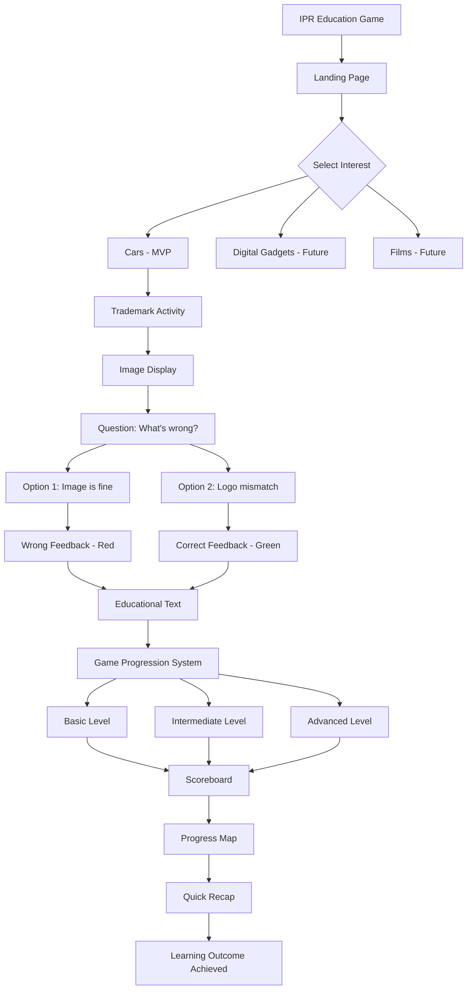

```mermaid
graph TD
    A[IPR Education Game] --> B[Landing Page]
    B --> C{Select Interest}
    C --> D[Cars - MVP]
    C --> E[Digital Gadgets - Future]
    C --> F[Films - Future]
    D --> G[Trademark Activity]
    G --> H[Image Display]
    H --> I[Question: What's wrong?]
    I --> J[Option 1: Image is fine]
    I --> K[Option 2: Logo mismatch]
    J --> L[Wrong Feedback - Red]
    K --> M[Correct Feedback - Green]
    L --> N[Educational Text]
    M --> N[Educational Text]
    N --> O[Game Progression System]
    O --> P[Basic Level]
    O --> Q[Intermediate Level]
    O --> R[Advanced Level]
    P --> S[Scoreboard]
    Q --> S[Scoreboard]
    R --> S[Scoreboard]
    S --> T[Progress Map]
    T --> U[Quick Recap]
    U --> V[Learning Outcome Achieved]
```