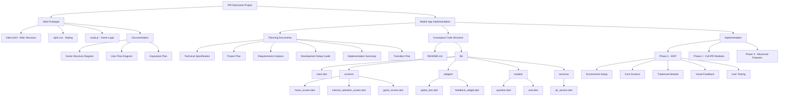

```mermaid
graph TD
    A[IPR EduGame Project] --> B[Web Prototype]
    A --> C[Mobile App Implementation]
    
    B --> B1[index.html - Main Structure]
    B --> B2[style.css - Styling]
    B --> B3[script.js - Game Logic]
    B --> B4[Documentation]
    
    B4 --> B41[Game Structure Diagram]
    B4 --> B42[User Flow Diagram]
    B4 --> B43[Expansion Plan]
    
    C --> C1[Planning Documents]
    C --> C2[Conceptual Code Structure]
    C --> C3[Implementation]
    
    C1 --> C11[Technical Specification]
    C1 --> C12[Project Plan]
    C1 --> C13[Requirements Analysis]
    C1 --> C14[Development Setup Guide]
    C1 --> C15[Implementation Summary]
    C1 --> C16[Transition Plan]
    
    C2 --> C21[README.md]
    C2 --> C22[lib/]
    
    C22 --> C221[main.dart]
    C22 --> C222[screens/]
    C22 --> C223[widgets/]
    C22 --> C224[models/]
    C22 --> C225[services/]
    
    C222 --> C2221[home_screen.dart]
    C222 --> C2222[interest_selection_screen.dart]
    C222 --> C2223[game_screen.dart]
    
    C223 --> C2231[option_box.dart]
    C223 --> C2232[feedback_widget.dart]
    
    C224 --> C2241[question.dart]
    C224 --> C2242[user.dart]
    
    C225 --> C2251[ipr_service.dart]
    
    C3 --> C31[Phase 1 - MVP]
    C3 --> C32[Phase 2 - Full IPR Modules]
    C3 --> C33[Phase 3 - Advanced Features]
    
    C31 --> C311[Environment Setup]
    C31 --> C312[Core Screens]
    C31 --> C313[Trademark Module]
    C31 --> C314[Visual Feedback]
    C31 --> C315[User Testing]
```