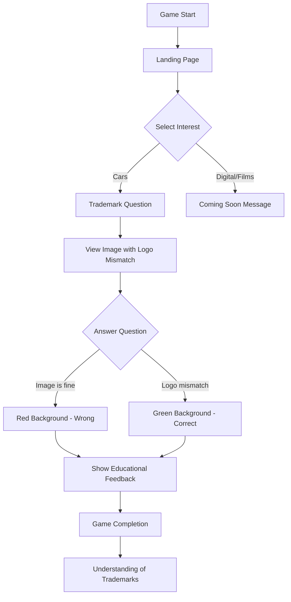

when a user selects the wrong option which is "image is fine" now he should get responce accordingly not the responce of the correct option of something "logo mismatch" this is because when the user has selected the wrong option then the system should give him the reason why he is wrong . This is because the user has selected the wrong option and he needs to know why he is wrong so that he can learn from his mistake and improve his understanding of trademarks. so please replace the text of  feedback after sselecting the option "image is fine"   